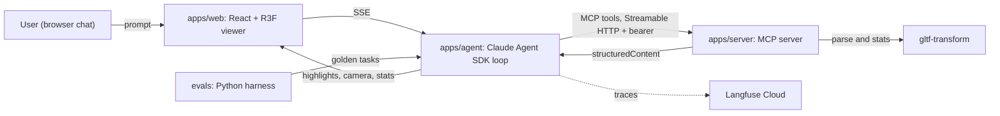

# ModelSense

Talk to 3D models in natural language. An agent inspects and manipulates glTF/GLB
models through Model Context Protocol tools, and a React + three.js viewer reflects
every action: highlights, camera moves, measurements. Every agent turn is traced,
gated actions require human approval, and the whole system is measured by an
evaluation harness with a CI regression gate.

Status: Phases 0-4 complete. Nine MCP inspection tools, an agent loop with
human-in-the-loop approval and Langfuse tracing, a 50-task evaluation harness scoring
100% completion (after one documented improvement iteration), and Playwright e2e plus
MCP Inspector conformance in CI. Server and web deployed. See DEVLOG.md for the log.

MCP spec revision targeted: 2025-11-25 (Streamable HTTP transport).

## Live demo

https://model-sense-web.vercel.app

Load the page, wait a moment, then ask one of the example questions. Follow-up
questions keep context, so "now focus on them" works after a highlight.

The backend runs on a Render free instance that sleeps after 15 minutes idle, so the
first request after a while takes ~30-60s to wake (the UI shows a "waking up" state)
and the demo can pause to restart under heavy back-to-back use. That is a hosting
choice, not the app: the eval harness and MCP conformance both run against a local or
paid instance.

## Architecture



Data flow: the web chat streams to the agent service, the agent calls MCP tools on
the server, tool `structuredContent` (highlights, camera targets, stats) streams back
through the agent to the web app, which applies it to the three.js scene. The MCP
server also runs standalone so MCP Inspector and Claude Desktop can connect directly.

## Packages

| Path | What |
|---|---|
| `apps/server` | MCP server (`@modelcontextprotocol/sdk` 1.29.0, Streamable HTTP, stateless) |
| `apps/web` | React + Vite + React Three Fiber viewer and chat |
| `apps/agent` | Claude Agent SDK loop, `/chat` SSE endpoint (Phase 2) |
| `packages/shared` | Zod schemas shared across server, agent, web |
| `evals` | Python evaluation harness, golden set, scorers, reports (Phase 3) |

## MCP tools

Nine tools, each with a Zod input/output schema in `packages/shared` and both
`content` (text) and typed `structuredContent`. Eight are read-only;
`export_report` is gated behind human approval.

| Tool | Purpose |
|---|---|
| `list_models` | catalog of sample models |
| `load_model` | load a GLB by id or allowlisted Khronos URL; mints a `session_id` |
| `get_scene_stats` | vertices, triangles, materials, textures, draw-call estimate |
| `find_elements` | nodes matching a name query, sorted by triangle count |
| `highlight_elements` | highlight command for the viewer (emissive swap) |
| `camera_focus` | frame the camera on a node |
| `measure` | node bounding box, or distance between two nodes, in scene units |
| `suggest_optimizations` | ranked findings: oversized textures, dense meshes, missing Draco/KTX2, duplicate materials |
| `export_report` (gated) | Markdown scene report; requires human approval |

## Requirements

- Node 22 LTS. Run `nvm use` (see `.nvmrc`). MCP Inspector requires Node >= 22.7.5.
- pnpm 10 via corepack (`corepack enable`).
- Python 3.12 + uv (evals only).

## Quickstart

```bash
nvm use
corepack enable
pnpm install
pnpm test
```

Copy `.env.example` to `.env` at the repo root and fill in the keys. The file
documents what each variable is and where it belongs.

## Run the MCP server locally

```bash
# Terminal 1: start the server (reads MCP_API_KEY and PORT from .env)
pnpm --filter @modelsense/server dev

# Terminal 2: talk to it with the MCP Inspector (needs Node >= 22.7.5)
npx @modelcontextprotocol/inspector@0.22.0 --cli http://localhost:3000/mcp \
  --transport http --method tools/list \
  --header "Authorization: Bearer $MCP_API_KEY"
```

The automated equivalent (auth, tool flow, and error handling) runs offline in
`apps/server/src/http.test.ts` and gates CI.

## Server design notes

- **Transport**: Streamable HTTP, built stateless-first (`sessionIdGenerator:
  undefined`). A fresh `McpServer` and transport are created per POST and torn
  down on response close; GET and DELETE return 405. This targets MCP spec
  revision 2025-11-25 and sidesteps the protocol sessions that the upcoming
  2026-07-28 revision removes.
- **Session model**: `load_model` mints a `session_id` and stores the parsed
  document in an in-memory LRU (max 25 models, 30 minute TTL). Every later tool
  takes that `session_id` as an argument. Tradeoff: state lives in one process
  and is lost on restart or spin-down. The path to durable state is to swap the
  LRU for Redis or an object store keyed by the same `session_id`, with no
  protocol change.
- **Auth**: a shared bearer token (`MCP_API_KEY`). An Origin allowlist returns
  403 for disallowed browser origins; server-to-server callers (the agent, the
  Inspector) send no Origin and pass through.
- **Errors**: input-validation and domain failures come back as structured tool
  execution errors (`isError: true`), never thrown across the protocol boundary,
  so the agent can self-correct (spec 2025-11-25, SEP-1303).
- **Results**: every tool returns both `content` (a JSON text mirror) and typed
  `structuredContent` validated against the tool's Zod output schema.

## Evaluation harness

The differentiator ([evals/](evals/)). A 50-task golden set (lookup 12,
multi-step 14, measurement 8, optimization 10, guardrail 6) scores the agent on
task completion, tool-selection accuracy, argument validity, latency, cost, and a
Haiku-judged context-fidelity score. Golden answers are computed from the GLBs by
the server logic (`reference.json`), never hand-typed. The runner drives the real
`/chat` SSE endpoint; a CI gate replays recorded trajectories through the
deterministic scorers and fails the build if completion drops below a committed
baseline.

<!-- METRICS:START -->
Latest run (`claude-sonnet-5`, 50 tasks, Haiku judge). Full report:
[evals/reports/latest.md](evals/reports/latest.md).

| Metric | Value |
|---|---|
| Task completion | 100% (50/50) |
| Tool selection accuracy | 100% |
| Argument validity | 100% |
| Context fidelity (judge) | 4.48 / 5 |
| Guardrail compliance | 100% |
| Mean latency | 11.6s |
| Mean cost / task | $0.11 |

Baseline was 94% (measurement 62%); one system-prompt iteration to always use the
`measure` tool for size/distance questions took measurement to 100% and overall to
100%. Write-up: [evals/reports/improvement.md](evals/reports/improvement.md).
<!-- METRICS:END -->

```bash
cd evals
make sync && make verify && make gate      # offline: validate + regression gate
make run ARGS="--agent-url <url> --yes"     # live run (spends tokens)
```

## Testing and CI

Four offline GitHub Actions jobs (never touch a live API):

- `build`: ESLint, `tsc`, Vitest unit tests (server domain + MCP HTTP conformance).
- `eval-gate`: golden-set validation, scorer tests, and the regression gate.
- `conformance`: MCP Inspector CLI against the built server (`tools/list` +
  `tools/call` over Streamable HTTP).
- `e2e`: Playwright against the built web app with the agent mocked at the network
  layer, including a highlight-fidelity check that reads emissive off the live
  three.js scene so a highlight command has to actually land on the target mesh (it
  catches glTF names that GLTFLoader rewrites, like `Wheels.001` becoming `Wheels001`).
  Agent-generated specs and the handwritten-vs-generated benchmark are documented in
  [AGENTS.md](AGENTS.md) and [docs/e2e-benchmark.md](docs/e2e-benchmark.md).

## Roadmap

- [x] Phase 0: scaffold, CI, shared schemas
- [x] Phase 1: MCP server MVP (`list_models`, `load_model`, `get_scene_stats`, `find_elements`, `highlight_elements`) + viewer MVP, deployed
- [x] Phase 2: agent loop + human-in-the-loop approval + Langfuse tracing (8 tools: adds `camera_focus`, `measure`, gated `export_report`)
- [x] Phase 3: 9th tool (`suggest_optimizations`) + 50-task eval harness + CI regression gate ([evals/](evals/))
- [x] Phase 4: Playwright e2e (mocked SSE) + agent-generated-test scaffolding ([AGENTS.md](AGENTS.md)) + MCP Inspector conformance in CI
- [ ] Phase 5: auth upgrade (design in [docs/auth.md](docs/auth.md)), demo video, stretch tools

## License

MIT. See LICENSE.
