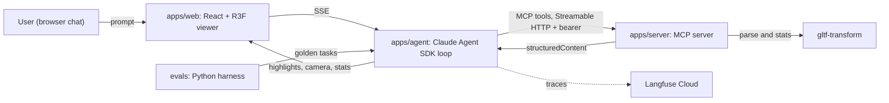

# ModelSense

Talk to 3D models in natural language. An agent inspects and manipulates glTF/GLB
models through Model Context Protocol tools, and a React + three.js viewer reflects
every action: highlights, camera moves, measurements. Every agent turn is traced,
gated actions require human approval, and the whole system is measured by an
evaluation harness with a CI regression gate.

Status: Phase 3 complete (50-task evaluation harness + CI regression gate). Nine MCP
inspection tools, agent loop with human-in-the-loop, Langfuse tracing. Server and web
deployed. See DEVLOG.md for the log.

MCP spec revision targeted: 2025-11-25 (Streamable HTTP transport).

## Architecture



Data flow: the web chat streams to the agent service, the agent calls MCP tools on
the server, tool `structuredContent` (highlights, camera targets, stats) streams back
through the agent to the web app, which applies it to the three.js scene. The MCP
server also runs standalone so MCP Inspector and Claude Desktop can connect directly.

## Packages

| Path | What |
|---|---|
| `apps/server` | MCP server (`@modelcontextprotocol/sdk` 1.29.0, Streamable HTTP, stateless) |
| `apps/web` | React + Vite + React Three Fiber viewer and chat |
| `apps/agent` | Claude Agent SDK loop, `/chat` SSE endpoint (Phase 2) |
| `packages/shared` | Zod schemas shared across server, agent, web |
| `evals` | Python evaluation harness, golden set, scorers, reports (Phase 3) |

## Requirements

- Node 22 LTS. Run `nvm use` (see `.nvmrc`). MCP Inspector requires Node >= 22.7.5.
- pnpm 10 via corepack (`corepack enable`).
- Python 3.12 + uv (evals only).

## Quickstart

```bash
nvm use
corepack enable
pnpm install
pnpm test
```

Copy `.env.example` to `.env` at the repo root and fill in the keys. The file
documents what each variable is and where it belongs.

## Run the MCP server locally

```bash
# Terminal 1: start the server (reads MCP_API_KEY and PORT from .env)
pnpm --filter @modelsense/server dev

# Terminal 2: talk to it with the MCP Inspector (needs Node >= 22.7.5)
npx @modelcontextprotocol/inspector@0.22.0 --cli http://localhost:3000/mcp \
  --transport http --method tools/list \
  --header "Authorization: Bearer $MCP_API_KEY"
```

The automated equivalent (auth, tool flow, and error handling) runs offline in
`apps/server/src/http.test.ts` and gates CI.

## Server design notes

- **Transport**: Streamable HTTP, built stateless-first (`sessionIdGenerator:
  undefined`). A fresh `McpServer` and transport are created per POST and torn
  down on response close; GET and DELETE return 405. This targets MCP spec
  revision 2025-11-25 and sidesteps the protocol sessions that the upcoming
  2026-07-28 revision removes.
- **Session model**: `load_model` mints a `session_id` and stores the parsed
  document in an in-memory LRU (max 25 models, 30 minute TTL). Every later tool
  takes that `session_id` as an argument. Tradeoff: state lives in one process
  and is lost on restart or spin-down. The path to durable state is to swap the
  LRU for Redis or an object store keyed by the same `session_id`, with no
  protocol change.
- **Auth**: a shared bearer token (`MCP_API_KEY`). An Origin allowlist returns
  403 for disallowed browser origins; server-to-server callers (the agent, the
  Inspector) send no Origin and pass through.
- **Errors**: input-validation and domain failures come back as structured tool
  execution errors (`isError: true`), never thrown across the protocol boundary,
  so the agent can self-correct (spec 2025-11-25, SEP-1303).
- **Results**: every tool returns both `content` (a JSON text mirror) and typed
  `structuredContent` validated against the tool's Zod output schema.

## Roadmap

- [x] Phase 0: scaffold, CI, shared schemas
- [x] Phase 1: MCP server MVP (`list_models`, `load_model`, `get_scene_stats`, `find_elements`, `highlight_elements`) + viewer MVP, deployed
- [x] Phase 2: agent loop + human-in-the-loop approval + Langfuse tracing (8 tools: adds `camera_focus`, `measure`, gated `export_report`)
- [x] Phase 3: 9th tool (`suggest_optimizations`) + 50-task eval harness + CI regression gate ([evals/](evals/))
- [ ] Phase 4: agent-generated Playwright tests + Inspector conformance + polish

## License

MIT. See LICENSE.
