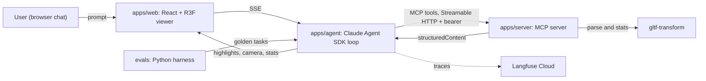

# ModelSense

Talk to 3D models in natural language. An agent inspects and manipulates glTF/GLB
models through Model Context Protocol tools, and a React + three.js viewer reflects
every action: highlights, camera moves, measurements. Every agent turn is traced,
gated actions require human approval, and the whole system is measured by an
evaluation harness with a CI regression gate.

Status: Phase 1 in progress (MCP server MVP + viewer MVP). See DEVLOG.md for the log.

MCP spec revision targeted: 2025-11-25 (Streamable HTTP transport).

## Architecture



Data flow: the web chat streams to the agent service, the agent calls MCP tools on
the server, tool `structuredContent` (highlights, camera targets, stats) streams back
through the agent to the web app, which applies it to the three.js scene. The MCP
server also runs standalone so MCP Inspector and Claude Desktop can connect directly.

## Packages

| Path | What |
|---|---|
| `apps/server` | MCP server (`@modelcontextprotocol/sdk` 1.29.0, Streamable HTTP, stateless) |
| `apps/web` | React + Vite + React Three Fiber viewer and chat |
| `apps/agent` | Claude Agent SDK loop, `/chat` SSE endpoint (Phase 2) |
| `packages/shared` | Zod schemas shared across server, agent, web |
| `evals` | Python evaluation harness, golden set, scorers, reports (Phase 3) |

## Requirements

- Node 22 LTS. Run `nvm use` (see `.nvmrc`). MCP Inspector requires Node >= 22.7.5.
- pnpm 10 via corepack (`corepack enable`).
- Python 3.12 + uv (evals only).

## Quickstart

```bash
nvm use
corepack enable
pnpm install
pnpm test
```

Copy `.env.example` to `.env` at the repo root and fill in the keys. The file
documents what each variable is and where it belongs.

## Roadmap

- [ ] Phase 0: scaffold, CI, shared schemas
- [ ] Phase 1: MCP server MVP (`list_models`, `load_model`, `get_scene_stats`, `find_elements`, `highlight_elements`) + viewer MVP, deployed
- [ ] Phase 2: agent loop + human-in-the-loop approval + Langfuse tracing
- [ ] Phase 3: 50-task eval harness + CI regression gate
- [ ] Phase 4: agent-generated Playwright tests + Inspector conformance + polish

## License

MIT. See LICENSE.
