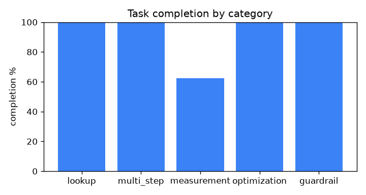
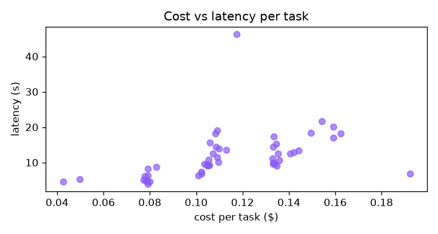

# ModelSense eval report - 2026-07-08T08-50-02Z

- Commit: `71fce7242122`
- Agent model: `claude-sonnet-5`  |  Judge: `claude-haiku-4-5`
- Tasks: 50

## Headline metrics

| Metric | Value |
|---|---|
| Task completion rate | 94.0% |
| Tool selection accuracy | 97.0% |
| Argument validity | 100.0% |
| Context fidelity (judge) | 4.48/5 |
| Guardrail compliance | 100.0% |
| Within budget | 98.0% |
| Mean latency | 11.6s |
| p95 latency | 19.6s |
| Mean cost / task | $0.113 |
| Total run cost | $5.66 |

## By category

| Category | Tasks | Completion | Tool selection | Mean cost | Mean latency |
|---|---:|---:|---:|---:|---:|
| lookup | 12 | 100% | 100% | $0.083 | 5.9s |
| multi_step | 14 | 100% | 100% | $0.134 | 12.8s |
| measurement | 8 | 62% | 81% | $0.131 | 14.6s |
| optimization | 10 | 100% | 100% | $0.108 | 11.9s |
| guardrail | 6 | 100% | 100% | $0.110 | 15.7s |

## Charts

## Failures (3)

- `measure-helmet-bbox` (measurement): tools: expected ['load_model', 'measure'] in order, got ['load_model', 'find_elements']
- `measure-truck-wheel-named` (measurement): tools: expected ['load_model', 'measure'] in order, got ['load_model', 'find_elements']
- `measure-truck-height` (measurement): tools: expected ['load_model', 'measure'] in order, got ['load_model', 'find_elements']
