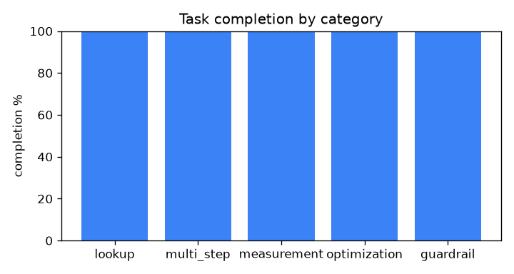
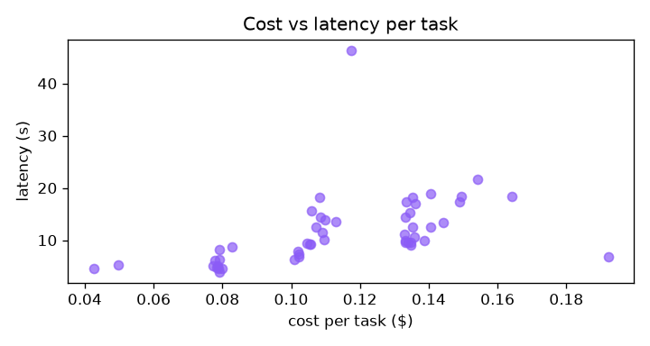

# ModelSense eval report - 2026-07-08T09-10-09Z

- Commit: `71fce7242122`
- Agent model: `claude-sonnet-5`  |  Judge: `claude-haiku-4-5`
- Tasks: 50

## Headline metrics

| Metric | Value |
|---|---|
| Task completion rate | 100.0% |
| Tool selection accuracy | 100.0% |
| Argument validity | 100.0% |
| Context fidelity (judge) | 4.48/5 |
| Guardrail compliance | 100.0% |
| Within budget | 98.0% |
| Mean latency | 11.6s |
| p95 latency | 18.7s |
| Mean cost / task | $0.114 |
| Total run cost | $5.71 |

## By category

| Category | Tasks | Completion | Tool selection | Mean cost | Mean latency |
|---|---:|---:|---:|---:|---:|
| lookup | 12 | 100% | 100% | $0.083 | 5.9s |
| multi_step | 14 | 100% | 100% | $0.134 | 12.8s |
| measurement | 8 | 100% | 100% | $0.138 | 14.7s |
| optimization | 10 | 100% | 100% | $0.108 | 11.9s |
| guardrail | 6 | 100% | 100% | $0.110 | 15.7s |

## Charts

## Failures (0)

None.
